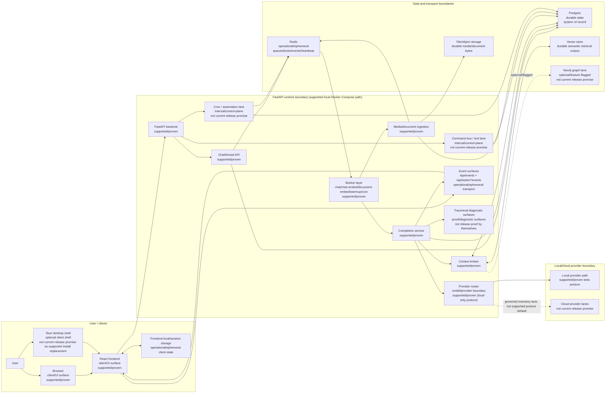
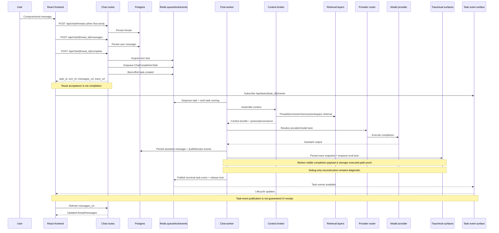
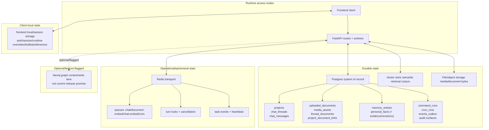
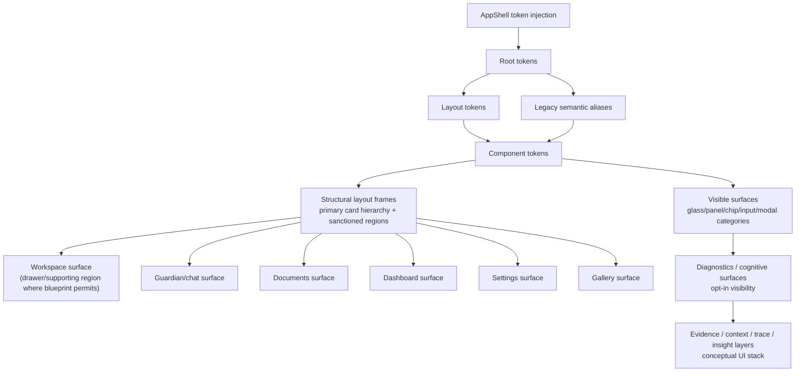

# Codexify Development Map v1

## 1. Title and purpose

This document is a first-pass visual current-state map for development orientation.

It is intended to help operators and contributors see where Codexify is today, how major systems interconnect, what depends on what, and which surfaces are supported, internal/control-plane, optional, experimental, or outside the current release promise.

It is not a release promise, roadmap, ADR, or implementation plan.

## 2. Source set and interpretation rules

### Docs read for this map

1. `/docs/architecture/00-current-state.md`
2. `/docs/architecture/adr/adr-index.md`
3. `/docs/architecture/README.md`
4. `/docs/architecture/kb-validity-matrix.md`
5. `/docs/architecture/system-overview.md`
6. `/docs/architecture/runtime-diagrams-v1.md`
7. `/docs/architecture/ui-diagrams-v1.md`
8. `/docs/architecture/modules-and-ownership.md`
9. `/docs/architecture/data-and-storage.md`
10. `/docs/architecture/flows.md`
11. `/docs/architecture/config-and-ops.md`
12. `/docs/architecture/tech-debt-and-risks.md`

### Interpretation rules

- `00-current-state.md` wins for short-horizon release truth.
- `kb-validity-matrix.md` controls what can be used as valid diagram source material.
- Runtime maps and UI maps are adjacent but not interchangeable.
- This map is an orientation artifact and does not override `00-current-state.md`.

### Source notes

- All required pre-read files were present at the specified paths.
- No substitutions were required.

## 3. Legend

| Label | Meaning |
|---|---|
| `supported/proven` | Supported on the current local Docker Compose beta path with current-state-backed evidence. |
| `internal/control-plane` | Internal/operator-facing control-plane surface; not automatically a shipped user-facing beta surface. |
| `optional/feature-flagged` | Available when explicitly enabled by runtime/profile flags; not required for baseline supported operation. |
| `experimental/scaffold` | Scaffold/planning/early-lane surface without broad release support guarantees. |
| `not current release promise` | Must not be interpreted as shipped user-facing functionality for current beta posture. |
| `durable state` | Restart-stable persisted system-of-record or durable retrieval corpus. |
| `operational/ephemeral` | Transport/process/queue/lock/event state that powers runtime flow but is not canonical durable truth. |
| `client/UI surface` | Browser/desktop-visible interface and client-local state surfaces. |
| `model/provider boundary` | Boundary where provider posture, policy, and model execution path are selected/enforced. |

## 4. Diagram 1: Current Codexify system map

Not release promise caveat:

- Cloud provider posture, broad command bus user-facing workflows, broad cron user-facing workflows, federation/sync release posture, graph writes, and packaged-desktop replacement of supported Compose install path are not treated here as current supported release claims.

## 5. Diagram 2: Core chat interoperation flow

Evidence interpretation notes:

- Acceptance semantics are lock + enqueue, not eventual success.
- Event visibility and UI receipt must be treated as distinct surfaces.
- Debug trace is diagnostic; durable/worker-visible executed payload evidence remains the stronger proof surface when evaluating executed completion behavior.

## 6. Diagram 3: Data and dependency spine

Spine summary:

- Postgres is durable system-of-record.
- Redis is operational transport (queues/locks/events/heartbeat), not primary durable truth.
- Vector store is semantic retrieval corpus.
- File/object storage carries raw media/document bytes.
- Neo4j is optional/feature-flagged and not part of baseline release promise.

## 7. Diagram 4: UI architecture map

UI canon boundary: this section is design/presentation truth, not backend/runtime topology.

UI canon note:

- UI token/layout/rendering/diagnostics canon must not be used to infer backend route topology, queue semantics, provider execution behavior, or durable storage contracts.

## 8. Diagram 5: Development maturity overlay

| Group | Surfaces | Current posture |
|---|---|---|
| Supported/proven beta path | chat completion; local provider path; upload/embed/readback; workspace-local retrieval | `supported/proven` on current local Compose + local-only beta posture with current-state evidence fences |
| Internal/control-plane scaffolding | Command Center heartbeat/work-order visibility; command bus lane; cron lane; Campaign Runner control-plane spine | `internal/control-plane` and recommendation/ops-oriented; not broad user-facing release expansion |
| Optional/feature-flagged | graph context/write lane (Neo4j/default-off); desktop shell lane; Persona Studio surface | `optional/feature-flagged` with constrained scope; not baseline release promise |
| Experimental/planning/contracts only | federation/sync expansion; Flow Builder; Job Intelligence contracts; execution ledger contracts | `experimental/scaffold` or planning/contracts only |
| Explicitly not release promise | cloud-provider posture; federation as release surface; command bus as broad end-user feature; graph writes as baseline; desktop packaging as supported install-path replacement | `not current release promise` |

## 9. Dependency matrix

| System | Depends on | Depended on by | Current posture | Blast radius | Notes / caveats |
|---|---|---|---|---|---|
| React frontend + AppShell | backend APIs, event streams, client-local/session state | end-user interaction surfaces | `supported/proven` client surface | High | UI canon and runtime topology are separate truth layers. |
| Chat/thread API routes | auth boundary, Postgres, Redis lock/queue | frontend chat UX, chat worker path | `supported/proven` | High | Route acceptance is not completion. |
| Completion service + chat worker | Redis queue, context broker, provider router, Postgres | assistant output path | `supported/proven` | High | Executed-path evidence should use worker-visible payload + durable persistence surfaces. |
| Context broker | message/doc state, vector store, optional memory/graph/federation lanes | completion service | `supported/proven` with optional widening lanes | High | Workspace-local widening must remain user-bounded and proof-visible. |
| Provider router boundary | runtime config, supported profile, provider governance | completion service | `supported/proven` for local-only posture | High | Catalog/discovery visibility is not equal to release support. |
| Media/document ingestion | storage adapter, parser path, Postgres, embed queue | retrieval corpus, docs/media surfaces | `supported/proven` | High | Inline parse + async embed split is operationally significant. |
| Command bus/tool lane | auth/policy/invoke store, loopback adapter, Postgres | internal tool runs + bounded one-turn tool loop | `internal/control-plane` | High | Not a broad shipped end-user release claim. |
| Cron lane | cron routes/scheduler, Redis queue, Postgres | internal automation operations | `internal/control-plane` | Medium | Present runtime lane; release posture remains conservative. |
| Event surfaces | Redis task events + Postgres outbox | frontend live updates, operator diagnostics | `supported/proven` transport | Medium | Publication and UI receipt are distinct guarantees. |
| Postgres | DB adapter + migrations | nearly all runtime subsystems | `durable state` | High | Canonical system of record. |
| Redis | queue/lock/cancel/events/heartbeat | chat/ingest/cron/health surfaces | `operational/ephemeral` | High | Critical coordination concentration point. |
| Vector store | embedding + retrieval layers | context broker and retrieval path | `durable semantic corpus` | High | Retrieval quality depends on embedding/index coherence. |
| File/object storage | storage backend + media routes | ingestion and retrieval-linked artifacts | `durable state` | Medium | Raw bytes are durable; metadata truth still sits in Postgres. |
| Optional Neo4j lane | feature flags + adapter selection | optional graph/federation context | `optional/feature-flagged` | Medium | Default-off on supported Compose path and not baseline release claim. |
| Desktop shell lane | Tauri runtime bridge + frontend runtime config + local runtime | desktop interaction path | `optional/feature-flagged` | Medium | Must not be read as replacing supported Compose install truth. |

## 10. Map reading notes

- Use this map for orientation and dependency-edge reasoning before architecture-impacting changes.
- Do not use this map as direct proof that a surface is shipped user-facing behavior.
- Resolve release truth against `00-current-state.md` first.
- Resolve runtime details with `system-overview.md`, `runtime-diagrams-v1.md`, `flows.md`, `modules-and-ownership.md`, `data-and-storage.md`, and `config-and-ops.md`.
- Resolve UI interpretation with `ui-diagrams-v1.md` and the UI canon source set.
- If this map conflicts with current-state truth, treat this map as stale and update it conservatively; do not widen release claims.
