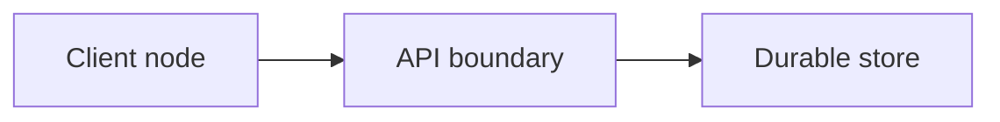
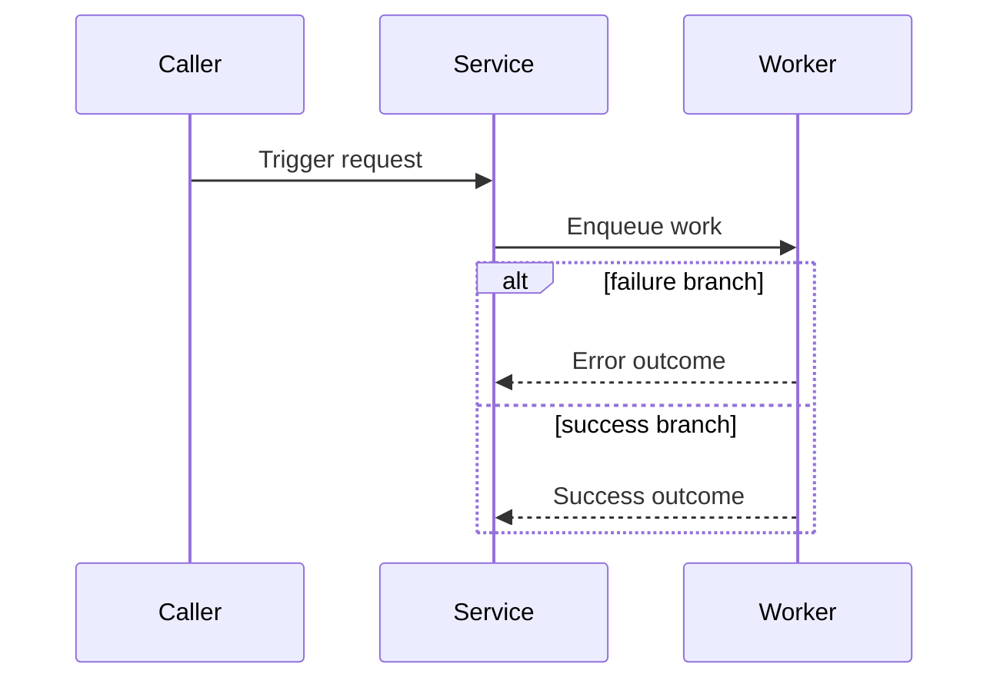
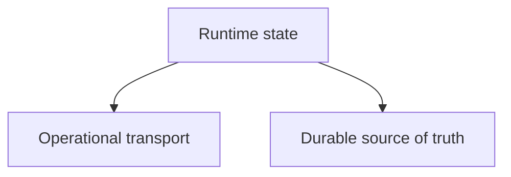

Purpose: Define how Codexify creates and maintains runtime architecture diagrams without drift, duplication, or low-signal documentation sprawl.
Last updated: 2026-05-11
Source anchors:
- docs/architecture/kb-validity-matrix.md
- docs/architecture/runtime-diagrams-v1.md
- docs/architecture/flows.md
- docs/architecture/modules-and-ownership.md

# Diagram Governance

Diagram Review Marker: 2026-05-11

## Scope

- This governance applies to first-pass runtime diagrams under `docs/architecture/`.
- The default scope is the Runtime Diagram Source Set v1 from `kb-validity-matrix.md`.
- This governance does not require full diagram coverage for all docs families.

## Non-goals

- No one-diagram-per-file policy.
- No coverage expansion into campaign logs, audits, prompt-docs, or historical archives.
- No duplicate visuals that restate unchanged global runtime diagrams.

## Runtime Source Set Policy

Use only the Runtime Diagram Source Set v1 by default:

- `/docs/architecture/00-current-state.md`
- `/docs/architecture/README.md`
- `/docs/architecture/system-overview.md`
- `/docs/architecture/flows.md`
- `/docs/architecture/data-and-storage.md`
- `/docs/architecture/config-and-ops.md`
- `/docs/architecture/modules-and-ownership.md`

`00-current-state.md` remains the short-horizon override when other sources conflict.

## Module Eligibility Gate

A module gets module-level diagrams only when one or more of the following are true:

- It crosses a trust boundary.
- It has async queue, retry, idempotency, or backpressure behavior.
- It has high blast-radius coupling.

If none apply, default to no new module-level diagrams and rely on canonical global packs.

## Required Metadata Per Diagram Section

Each module-level diagram section must include:

- Source anchors
- Confidence level (`high`, `moderate`, `low`)
- Last-reviewed date (`YYYY-MM-DD`)

## Standard Diagram Templates

Use these three templates for eligible modules.

### 1) Context Map

Use for node boundaries and trust boundaries.

```md
### Context Map
Last reviewed: YYYY-MM-DD
Confidence: high|moderate|low
Source anchors:
- path/a
- path/b



Trust boundaries:
- boundary A
- boundary B
```

### 2) Primary Sequence

Use for trigger-to-output runtime flow and key failure branch.

```md
### Primary Sequence
Last reviewed: YYYY-MM-DD
Confidence: high|moderate|low
Source anchors:
- path/a
- path/b


```

### 3) State/Data Boundary

Use for source-of-truth, consistency target, idempotency, retry, and backpressure notes.

```md
### State and Data Boundary
Last reviewed: YYYY-MM-DD
Confidence: high|moderate|low
Source anchors:
- path/a
- path/b



State notes:
- Source-of-truth: ...
- Consistency target: strong|causal|eventual
- Idempotency key: ...
- Retry/backoff: ...
- Backpressure control: ...
```

## Freshness Workflow

- `scripts/check_diagram_freshness.py` reads git diff and checks for Runtime Diagram Source Set changes.
- If runtime source docs changed and no review-marker update is present, the script warns by default.
- Marker updates are recognized from this file and `module-diagram-coverage-matrix.md` via the `Diagram Review Marker:` line.
- Optional auto-regeneration:
  - `python scripts/check_diagram_freshness.py --auto-regenerate --regenerate-cmd "<your command>"`
- Optional watch mode for save-time regeneration:
  - `python scripts/check_diagram_freshness.py --watch --regenerate-cmd "<your command>"`

## Promotion Path

- Default mode is warning-only.
- When the workflow is stable, run strict mode with:
  - `python scripts/check_diagram_freshness.py --strict`

## Maintenance Rule

When runtime diagram source docs change materially:

1. Update affected diagram sections or explicitly record no-change rationale.
2. Update `Diagram Review Marker:` in this file or in `module-diagram-coverage-matrix.md`.
3. Re-run docs checks.
