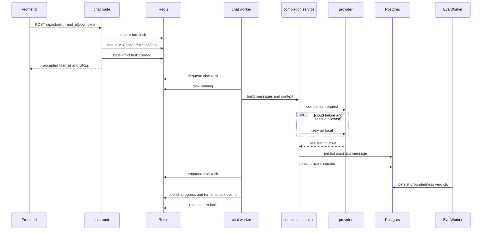
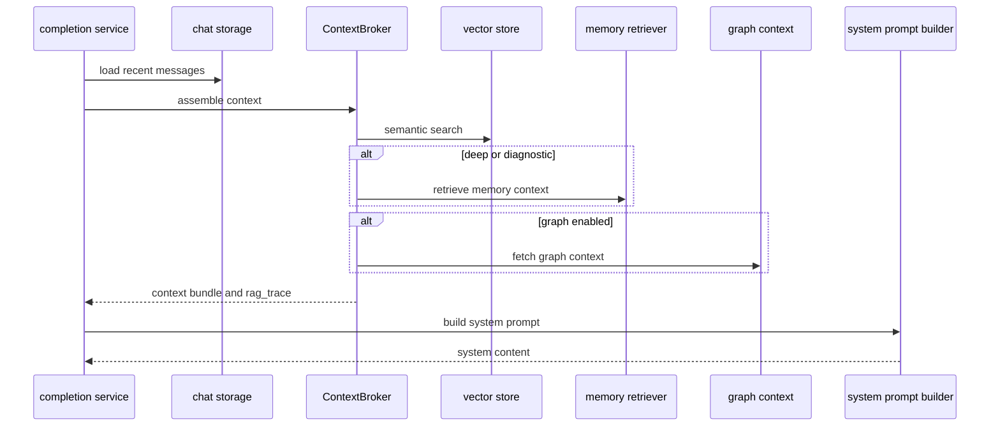
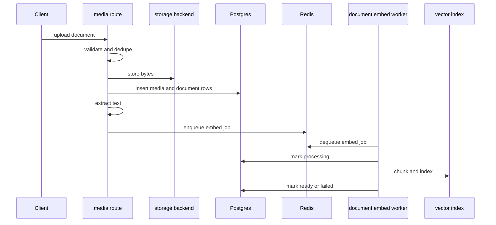
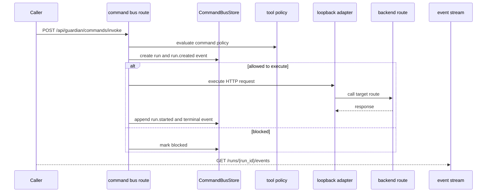

Purpose: Document Codexify's highest-value runtime flows in trigger-to-output form so PMs and senior engineers can reason about latency, failure propagation, and change impact without re-deriving the call graph.
Last updated: 2026-05-08
Source anchors:
- guardian/routes/
- guardian/core/
- guardian/context/
- guardian/cognition/
- guardian/memoryos/
- guardian/services/
- guardian/queue/
- guardian/workers/
- guardian/command_bus/
- guardian/cron/
- guardian/sync/
- guardian/realtime/

# Critical Flows

## 1) Chat Completion Flow

Trigger:
- Frontend posts `POST /api/chat/{thread_id}/complete` after a user message exists in the thread.
- When the composer starts a brand-new conversation, the frontend first creates a backend thread with `POST /api/chat/threads`, resolves the durable thread id from the response, selects that id, and only then posts the first user message to `POST /api/chat/{thread_id}/messages`.

Sequence:
1. `guardian/routes/chat.py` validates the thread, turn state, and effective identity depth.
2. The route acquires a Redis turn lock whose owner is the new `task_id`.
3. If the thread already has a stale lock, recovery only occurs when real evidence says it is safe:
   - terminal task-stream evidence is enough to clear the old lock
   - or the old task is still nonterminal and the worker heartbeat is `stale`, `dead`, or `missing`
   - if task-stream or heartbeat evidence is `unknown`, recovery fails closed and the route returns `429 turn_in_flight`
4. The route enqueues a `ChatCompletionTask` on `codexify:queue:chat`.
5. The route attempts to publish `task.created` as a lifecycle breadcrumb.
6. `guardian/workers/chat_worker.py` dequeues the task and publishes `task.running`.
7. `guardian/core/chat_completion_service.py` loads recent messages, assembles context, resolves provider/model/profile settings, and carries the live retrieval posture for the turn.
   - For `retrievalSource="workspace"`, the intended contract is that Obsidian-backed evidence can be selected and injected in executed completion context.
   - Current live behavior for that workspace-local Obsidian selection/injection path remains under active validation and is not currently treated as settled release evidence.
8. The provider call executes through `guardian/core/ai_router.py`.
   - If the provider returns plain assistant text, the existing completion path continues.
   - If the provider returns a structured tool decision, the completion service executes exactly one command through `guardian/command_bus/`, reinjects the result, and requests one final assistant answer.
   - No second tool turn is permitted in this slice.
   - If a non-local provider fails and the selection is eligible for rescue, the worker may retry once on local inference.
   - The context broker starts with active thread messages, then thread-local semantic context, then thread-linked docs. Project docs only enter when the thread is project-bound or the selected posture explicitly allows broader local retrieval.
   - When `retrievalSource="workspace"`, the completion service asks `ContextBroker` for user-bounded local knowledge, including Obsidian-backed notes; proving reliable selection/injection in executed turns remains an active validation target.
   - For the workspace proof harness, executed-path worker-visible completion payload evidence is the canonical proof surface; debug trace remains diagnostic-only and cannot replace the executed completion record.
9. Assistant output is persisted to Postgres, audited, optionally embedded, and emitted as domain events.
10. After the assistant row is durably stored, the worker captures a trace snapshot, persists it to Postgres, and best-effort enqueues an eval task on the derived inspection lane.
   - The snapshot is expected to carry containment-grade retrieval policy, provenance, suppression, and image-routing truth when available, including explicit absence reasons rather than silent nulls.
   - For workspace-local completions, the terminal task payload and persisted snapshot keep the executed retrieval posture and evidence counts aligned with the worker attempt.
   - For workspace-local proof, the worker-visible task payload is the canonical evidence surface; the debug trace remains diagnostic and must not backfill missing workspace evidence.
11. The eval worker later reads the snapshot, produces attempt-scoped verdict rows, and stores them in Postgres without affecting chat completion success.
12. The worker publishes terminal task events and releases the turn lock in `finally`.
13. The live debug RAG trace endpoint promotes completion metadata from the latest task event payload when available, and can fall back to the latest eval snapshot to expose retrieval policy, provenance, suppression summaries, image-routing decisions, and model-selection truth for operator diagnosis.

Outputs:
- Immediate HTTP response with `task_id`, `turn_id`, `messages_url`, and `trace_url`
- Task event stream via `/api/tasks/{task_id}/events`
- Assistant `chat_messages` row plus related audit/domain events
- Durable eval trace snapshot row plus attempt-scoped verdict rows
- Worker logs that now distinguish task execution from task-event visibility degradation

Failure modes:
- `429 turn_in_flight` when the thread lock already exists
- `429 turn_in_flight` when stale-lock recovery refuses to guess on ambiguous evidence
- `503 queue_unavailable` when Redis enqueue fails
- Provider connectivity or timeout failures that become `task.failed`
- Cloud-provider failure that rescues to local execution instead of failing outright
- Blank or malformed provider output forcing fallback assistant text
- Structured tool-decision failure that stops after one bounded tool turn and surfaces explicit loop-stop metadata
- Eval snapshot persistence or enqueue failure, which is isolated from chat completion acceptance
- Eval worker failure, which is isolated from chat completion acceptance and transcript persistence
- Worker downtime causing tasks to queue without completion
- Task-event publish failures that degrade progress or terminal visibility without necessarily stopping execution

Acceptance semantics:
- Normal acceptance means the route acquired the turn lock and enqueued the task.
- The route does not prove dequeue, eventual success, or UI receipt.
- If enqueue succeeds but `task.created` cannot be published, the system is operationally in a degraded-acceptance state even though the current route payload still returns success. The queue acceptance is real; the lifecycle visibility is weaker.
- Post-completion eval is derived inspection only. It does not change acceptance, does not gate completion, and does not replace the transcript as the canonical chat output.
- A canonical live-proof harness is still the intended way to validate the workspace retrieval seam end-to-end: `scripts/proofs/prove_workspace_obsidian_e2e.py`. A prior PASS interpretation was superseded by later testing, so current release interpretation remains in-progress pending renewed live evidence.
- For the workspace proof harness on the supported local Compose path, acceptance is only the first milestone; the proof must also verify terminal task evidence, persisted assistant text, and workspace-local retrieval posture before it can pass.
- For `retrievalSource="workspace"`, vector-store searchability alone is weaker than completion-context inclusion; the proof must show broker selection and injection for the Obsidian-backed note.
- For `retrievalSource="workspace"`, the proof harness must read the worker-visible completion payload as the success source of truth and treat the debug trace as a comparison surface only.

Debug trace note:
- The live `/api/chat/debug/rag-trace/{thread_id}/latest` route may surface sanitized trace availability, effective policy, retrieval summary/provenance, and image-routing metadata when a real trace exists.
- Treat that route as diagnostic/operator evidence only; do not treat it as durable release proof.
- Durable eval snapshots remain the stronger persistence-backed proof surface.
- The debug route must not expose raw image or document content, hidden prompts, chain-of-thought, or secrets.

Conceptual state split:
- The runtime docs now recognize a distinction between provider runtime state, request execution state, and lifecycle visibility state.
- Provider runtime state answers whether the selected provider lane is reachable, warming, ready, or otherwise degraded.
- Request execution state answers what a specific completion attempt is doing after acceptance.
- Lifecycle visibility state answers what the UI or operator can currently observe from task events, persisted assistant rows, and related breadcrumbs.
- `docs/architecture/chat-runtime-contract.md` is the normative source for the request/provider state vocabulary used by frontend/shared-runtime interpretation.
- This flow remains descriptive of the current queue-backed path. It should not be read as proof that every contract state is already emitted literally by the backend on `main`.

Concrete anchors:
- `guardian/routes/chat.py`
- `guardian/core/chat_completion_service.py`
- `guardian/workers/chat_worker.py`
- `guardian/queue/redis_queue.py`
- `guardian/queue/task_events.py`

## 2) RAG / Context Assembly Flow

Trigger:
- Completion service builds the provider-ready message list for a chat turn.

Sequence:
1. Load recent thread messages from chat storage.
2. Use the latest user utterance as the semantic retrieval query.
3. `ContextBroker.assemble()` first resolves a retrieval policy, then gathers:
   - recent messages
   - verified active personal facts scoped to the resolved user
   - semantic vector matches unless depth is `shallow`
   - thread-local semantic matches before any broader local widening
   - linked project/thread documents under the same scope boundary
   - memory retrieval for `deep` and `diagnostic`
   - graph context when `GUARDIAN_ENABLE_GRAPH_CONTEXT=true`
   - sensor diagnostics and optional federated context when requested
   - workspace-local retrieval, which keeps the same-user boundary but can widen beyond the thread into the local working set, including Obsidian-backed notes
   - selected-item provenance plus suppression summaries so operator traces can show what was included, what was filtered, and why
4. `build_guardian_system_prompt()` and context rendering functions produce the system-side prompt block, including a bounded verified-personal-facts section when eligible facts exist.
5. The final LLM input is the system/context block plus conversation messages.
6. The live RAG trace/debug payload preserves the retrieval policy and, when surfaced by the completion path, the completion model-selection and image-routing metadata needed to explain why a turn was included, suppressed, widened, or captioned.

Outputs:
- Provider-ready message array
- `rag_trace` payload for debugging and UI inspection
- `rag_trace` retains transient provenance and suppression metadata for diagnosis, but it is still not a durable forensic store
- Effective retrieval depth and document context metadata

Failure modes:
- Vector store unavailable, producing empty semantic results
- Memory or graph adapters failing soft and reducing context depth
- No usable thread context, causing route-level rejection before worker execution
- Prompt builder errors, causing fallback safety/system prompt behavior
- Context assembly success still does not prove terminal task-event visibility or UI receipt

Concrete anchors:
- `guardian/core/chat_completion_service.py`
- `guardian/context/broker.py`
- `guardian/memoryos/retriever.py`
- `guardian/cognition/system_prompt_builder.py`
- `guardian/cognition/prompts.py`

## 3) Ingestion Flow

Trigger:
- Client uploads a document or image through `/api/media/upload/*`, or creates a generated document via `/api/documents/generate`.

Sequence:
1. `guardian/routes/media.py` validates file type and reads the upload bytes.
2. The route computes canonical media identity and checks for dedupe hits.
3. New assets are written through the configured storage backend and corresponding DB rows are inserted.
4. For supported documents, text extraction happens inline in the API process.
5. When text is available, `enqueue_document_embed()` pushes a job to `codexify:queue:document-embed`.
6. `guardian/workers/document_embed_worker.py` chunks text, embeds it, indexes the vectors, and updates `embedding_status`.
7. Optional thread/project link rows are created so the RAG path can see the document later.

Outputs:
- Upload response containing explicit `document_id` and `media_asset_id` plus backward-compatible `id`
- Updated `uploaded_documents` row with parse and embedding lifecycle fields
- Vector index entries for searchable document content

Supported readback contract:
- `GET /api/documents/{id}` is the supported document detail route for upload -> embed -> retrieve proof.
- The detail route resolves document identity by `uploaded_documents.id` and preserves compatibility lookup by `asset_id`.
- The detail payload is expected to include embedding lifecycle visibility (`embedding_status`, `embedding_error`, `embedding_started_at`, `embedding_completed_at`) without requiring direct DB inspection.

Failure modes:
- Unsupported MIME/type returns `400`
- Parser failures leave `parsed_text` empty or mark embedding failed
- Queue or embedding backend failures leave documents in `failed`
- Storage backend misconfiguration breaks upload even before parsing

Concrete anchors:
- `guardian/routes/media.py`
- `guardian/services/document_parsers/`
- `guardian/services/document_chunking.py`
- `guardian/queue/document_embed_queue.py`
- `guardian/workers/document_embed_worker.py`
- `guardian/routes/documents.py`

## 4) Tool Execution and Job Flow

Trigger:
- A caller invokes `/api/guardian/commands/invoke` or creates a cron job that later queues work.

Sequence:
1. The command bus derives a manifest from the app's OpenAPI surface.
2. `execute_invoke()` validates invoke version, actor claim, payload size, and idempotency.
3. Tool policy is evaluated and the run is persisted through `CommandBusStore`.
4. Allowed commands execute via loopback HTTP back into the same backend, guarded against recursion.
5. Run events are appended and can be streamed from `/api/guardian/commands/runs/{run_id}/events`.
6. The legacy `/tools` layer derives tool specs from the command manifest but still keeps some process-local job state.
7. Cron jobs follow a separate path: scheduler finds due jobs, creates `cron_runs`, enqueues work, and `cron_worker` executes it.
8. The bounded chat tool-turn slice also lands on this command-bus lane, but it remains one turn only and does not become a recursive agent loop.
9. Cron jobs follow a separate path: scheduler finds due jobs, creates `cron_runs`, enqueues work, and `cron_worker` executes it.
10. When a completion turn includes image attachments, the completion service first checks the selected model's vision capability:
    - explicit vision support keeps the turn on the multimodal path and preserves image-turn context suppression
    - explicit lack of vision support fails closed before provider execution with a machine-readable validation error
    - unknown vision capability preserves the existing fallback behavior instead of inventing a new governance rule

Outputs:
- Command bus run record plus event stream
- HTTP side effects for invoked read or allowed write commands
- Cron run history in Postgres
- Command bus run record plus event stream are the only supported tool-execution outputs

Failure modes:
- Policy block or missing confirmation leaves runs in `blocked`
- Idempotency conflicts return the existing run instead of re-executing
- Loopback base URL misconfiguration prevents execution
- Legacy tool job snapshots are not durable across process restarts

Concrete anchors:
- `guardian/routes/command_bus.py`
- `guardian/command_bus/invoke.py`
- `guardian/command_bus/store.py`
- `guardian/command_bus/loopback_http_adapter.py`
- `guardian/routes/cron.py`
- `guardian/cron/scheduler.py`
- `guardian/workers/cron_worker.py`

The bounded chat tool-loop slice uses this same command-bus lane. It may execute one command, reinject the result into the completion context, and then hard-stop after that single tool turn.

The Guardian-mediated coding-agent slice follows the same operator-truth rule: execution completion is not enough by itself, the returned coding result must land back in the source thread, and that returned result must preserve source thread, source message, and job lineage. Result return must be idempotent. If Guardian cannot write the result back, treat that as an operator-visible handoff failure rather than a successful user-visible completion.

## 5) Sync / Federation Flow

Trigger:
- A node calls federation endpoints, or a client posts a sync event to `/api/sync/event`.

Sequence:
1. Federation routes check feature flags and trust-policy requirements.
2. Session, manifest, relay, diff, or context requests validate target node and signature/policy state.
3. Context requests can search local graph context and active peers.
4. The separate sync API accepts an event, applies idempotent side effects, and publishes to an in-process SSE bus.

Outputs:
- Federation session metadata, peer responses, or context/diff payloads
- Sync event acknowledgement and live subscriber updates

Failure modes:
- Federation disabled or unsigned policy rejected
- Egress or target allowlist denial
- Sync bus subscribers losing continuity on process restart because the bus is process-local

Concrete anchors:
- `guardian/routes/federation.py`
- `guardian/routes/federation_context.py`
- `guardian/sync/api.py`
- `guardian/sync/bus.py`

## Latency and Coupling Notes

- Highest synchronous latency tends to accumulate in:
  - provider API calls
  - document parsing during upload
  - vector retrieval and memory retrieval in deep modes
  - loopback tool execution when a command triggers heavier backend routes
- Highest cascade risk lives in:
  - Redis availability for chat, cron, and task streams
  - config/startup mismatch before the backend fully boots
  - the shared completion service and chat worker path
