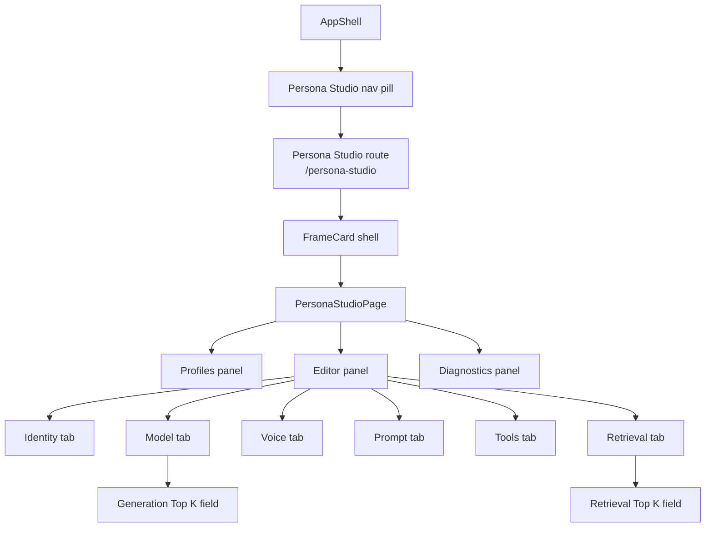
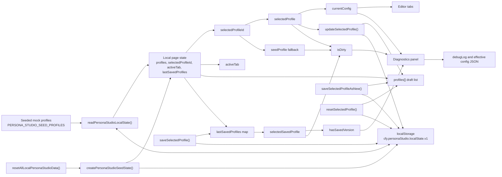
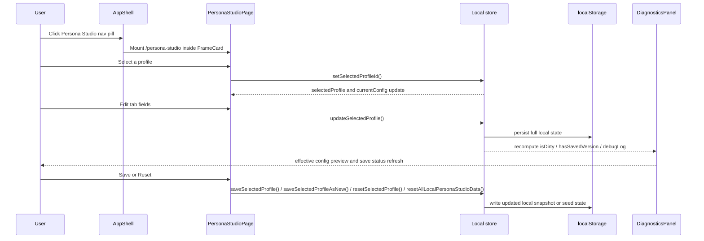

Purpose: Document Persona Studio as it exists in the shell today so readers can understand the page structure, local state flow, and boundary limits without reading implementation code first.
Last updated: 2026-04-01
Source anchors:
- frontend/src/components/persona/layout/AppShell.tsx
- frontend/src/features/personaStudio/PersonaStudioPage.tsx
- frontend/src/features/personaStudio/personaStudioStore.ts
- frontend/src/features/personaStudio/__tests__/PersonaStudioShell.test.tsx
- frontend/src/features/personaStudio/__tests__/PersonaStudioPage.persistence.test.tsx
- docs/architecture/persona-studio-spec.md

# Persona Studio Architecture

## Purpose and Scope

Persona Studio is a non-conversational configuration surface for persona and profile settings.

It exists to define persona/profile settings before runtime selection, not inside a chat turn. In this note, "mocked" means seeded or locally synthesized in the browser, not fetched from or enforced by backend runtime.

Persona Studio is:

- not a chat surface
- not a memory-writing surface
- not a thread/history surface
- not a runtime assistant session

## Current Implementation Status

| Surface | Status now | Meaning |
|---|---|---|
| AppShell navigation entry and route | runtime-active | `AppShell` exposes `/persona-studio` as a first-class shell view and renders the page inside a `FrameCard`. |
| Three-panel layout | runtime-active | The page renders left Profiles, center Editor, and right Diagnostics panels. |
| Seeded profile list | mocked / seeded | The profile list comes from built-in seed drafts in `personaStudioStore.ts`, not from a backend profile API. |
| Editor draft state | frontend-local | The selected profile draft is mutated in browser state and persisted to localStorage. |
| Diagnostics panel | frontend-local preview | The panel renders a JSON config preview plus a synthetic debug log derived from the current draft. |
| Save / Reset / Save As New | frontend-local only | These actions update local snapshots or restore seed/saved drafts; they do not mutate backend runtime. |
| Runtime profile application | not wired | The selected profile is not yet applied to live chat, memory, tool execution, or voice runtime. |

### Presentational, Frontend-Local, Runtime-Bound

| Category | Current contents |
|---|---|
| Presentational | Shell nav entry, route switch, frame wrapper, three panels, tabs, form controls, badges, diagnostics card |
| Frontend-local state | Seed profiles, selected profile, active tab, editable draft fields, saved snapshots, debug log, localStorage persistence |
| Runtime-bound behavior | None yet for profile CRUD, live assistant session binding, memory writes, or runtime enforcement |

### What Is Not Yet Wired

- No backend persistence contract for profiles
- No live application of persona settings to chat, voice, retrieval, or tools runtime
- No import/export/delete flow in the current page
- No server-driven diagnostics feed or validation loop

### Do Not Assume

- Do not assume Save writes to a backend service
- Do not assume Reset changes live assistant behavior
- Do not assume selecting a profile changes an active thread or session
- Do not assume Generation Top K and Retrieval Top K are interchangeable
- Do not assume any profile control is enforced outside this page yet

## Where It Lives in the Shell

Persona Studio is a top-level AppShell view alongside Guardian, Dashboard, Documents, Gallery, and Settings.

- Route mapping: `/persona-studio`
- Shell entry: the navigation pill in `frontend/src/components/persona/layout/AppShell.tsx`
- Mounted content: `PersonaStudioPage` rendered inside a `FrameCard`

This matters because the page is not nested inside chat or settings as a subpanel. It is a sibling shell surface.

## UI Structure

The page uses a simple three-panel layout:

- Left panel: Profiles
- Center panel: Editor
- Right panel: Diagnostics

The center panel contains six tabs:

- Identity
- Model
- Voice
- Prompt
- Tools
- Retrieval

The Model tab contains generation controls, including `Generation Top K`.

The Retrieval tab contains retrieval controls, including `Retrieval Top K`.

These are separate concepts and must remain separate.

## Data Model

The current screen uses a narrower frontend-facing shape than the broader product spec. The effective profile draft shape is:

```ts
type PersonaStudioLocalState = {
  profiles: PersonaProfileDraft[];
  selectedProfileId: string;
  activeTab: "identity" | "model" | "voice" | "prompt" | "tools" | "retrieval";
  lastSavedProfiles: Record<string, PersonaProfileDraft>;
};

type PersonaProfileDraft = {
  id: string;
  name: string;
  description: string;
  isDefault?: boolean;
  config: {
    identity: {
      name: string;
      description: string;
    };
    model: {
      provider: string;
      model: string;
      temperature: number;
      topK: number;
      topP: number;
      maxTokens: number;
    };
    voice: {
      enabled: boolean;
      provider: string;
      voicePreset: string;
      speed: number;
      wakeWord: string;
      interruptible: boolean;
    };
    prompt: {
      systemPrompt: string;
      styleNotes: string;
      directives: string;
    };
    tools: {
      pinnedTools: string[];
      allowedTools: string[];
      skills: string[];
      permissions: {
        web: boolean;
        email: boolean;
        calendar: boolean;
        cli: boolean;
        filesystem: boolean;
      };
    };
    retrieval: {
      enabled: boolean;
      mode: string;
      topK: number;
      rerank: boolean;
    };
  };
};
```

Diagnostics-facing derived state is not a separate persisted contract. It is computed from the selected draft and the local save snapshot:

- `selectedProfile`
- `currentConfig`
- `selectedSavedProfile`
- `seedProfile`
- `isDirty`
- `hasSavedVersion`
- `debugLog`

## State Flow

1. `readPersonaStudioLocalState()` loads local state from localStorage, or falls back to built-in seed profiles if nothing valid exists.
2. `selectedProfileId` chooses the current draft; `activeTab` chooses the visible editor subpanel.
3. `selectedProfile` and `currentConfig` are derived from the selected draft, not stored as separate backend truth.
4. `updateSelectedProfile()` mutates the selected draft inside the `profiles` array.
5. A `useEffect` persists the full local state back to localStorage after each state change.
6. `isDirty` is computed by comparing the selected draft to the selected saved snapshot, or to the built-in seed fallback if no snapshot exists.
7. `hasSavedVersion` is true when a local saved snapshot exists for the selected profile.
8. `DiagnosticsPanel` builds a local `debugLog` from the selected profile and config, then renders the effective config JSON preview plus save status.
9. `saveSelectedProfile()` clones the current draft into `lastSavedProfiles`.
10. `saveSelectedProfileAsNew()` clones the current draft, assigns a new profile ID, selects the new copy, and stores it locally.
11. `resetSelectedProfile()` restores the selected draft from the last saved snapshot or the seed profile for that ID.
12. `resetAllLocalPersonaStudioData()` restores the entire seeded browser state.

The practical relationship is:

- selected profile state is the source for the editor
- active tab state controls which editor section is visible
- draft field edits update the selected profile
- diagnostics state is derived from the selected profile and save snapshot
- save/reset actions only reshuffle local browser state

## Diagrams

### A. Component Hierarchy



### B. Data Flow



### C. User Interaction Flow



## Boundary Rules

Persona Studio does not:

- create chat messages
- create thread history
- write long-term memory
- act as a runtime assistant session
- apply profile settings to live runtime yet

Unless a later architecture note says otherwise, this page should be treated as a browser-local configuration surface only.

## Next-Step Recommendations

Likely next phases, if the surface is promoted beyond local preview, are:

- local draft persistence beyond the current browser state model
- backend persistence contract for profile CRUD and snapshots
- runtime profile application to chat, voice, retrieval, and tool binding
- permissions and capability enforcement for selected profiles
- voice and runtime validation against live execution instead of local preview

None of those phases are implemented by this note; they are forward-looking only.
