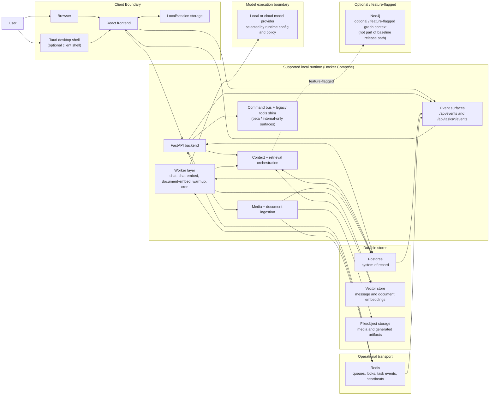
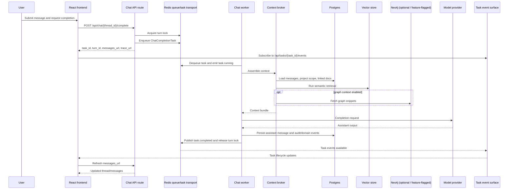
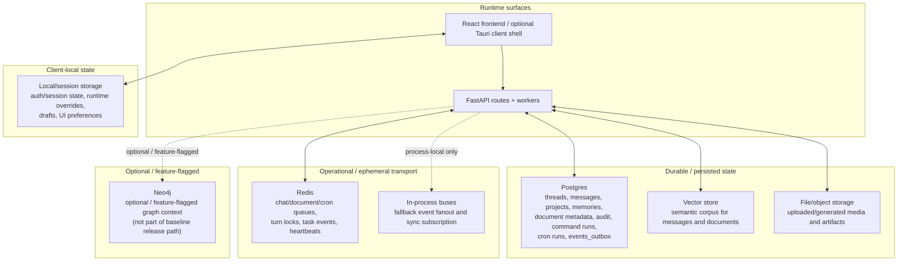
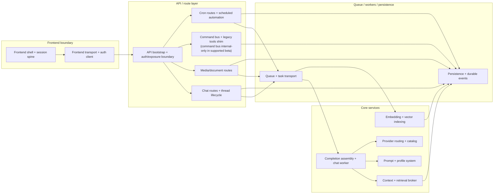

# Codexify Runtime Diagrams v1

## Purpose

This document is the first-pass runtime diagram pack derived only from the validated runtime KB source set. It is a baseline runtime view for peer review, not a final presentation artifact.

## Source set used

- `/docs/architecture/00-current-state.md`
- `/docs/architecture/README.md`
- `/docs/architecture/system-overview.md`
- `/docs/architecture/flows.md`
- `/docs/architecture/data-and-storage.md`
- `/docs/architecture/config-and-ops.md`
- `/docs/architecture/modules-and-ownership.md`

## Interpretation constraints

- `00-current-state.md` overrides broader docs on short-horizon release reality.
- These diagrams reflect the current runtime baseline, not aspirational architecture.
- Optional or not-currently-active systems are labeled explicitly.
- Quarantined legacy docs were not used.

## Diagram legend

- `durable`: persisted state or system-of-record surfaces that the validated runtime docs treat as restart-stable.
- `operational / ephemeral`: queues, locks, event transport, or process-local state that keep the runtime moving but are not primary durable truth.
- `optional`: present in current runtime docs but not required for the baseline supported path.
- `feature-flagged`: available only when explicit runtime flags or policy enable it.
- `release-bounded exclusion`: intentionally omitted from v1 because the validated runtime docs do not treat it as part of the present release promise.

## Diagram 1: Runtime Topology Overview

### high confidence

This is a coarse runtime topology map for the validated baseline.

Supported runtime topology is the local Docker Compose stack. Non-Compose deployment remains unverified in the validated source set.

### Evidence notes

- Primary sources: `/docs/architecture/00-current-state.md`, `/docs/architecture/system-overview.md`, `/docs/architecture/config-and-ops.md`
- Conservative assumptions: worker types are collapsed into one worker layer, event surfaces are grouped into one runtime boundary, and provider execution is shown as one policy-shaped boundary rather than per-provider lanes.
- Explicit exclusions: non-Compose deployment detail, one-shot bootstrap services, federation/sync surfaces, and provider inventory/governance nuance beyond the current execution boundary.

## Diagram 2: Chat Completion Sequence

### high confidence

This sequence keeps the baseline completion loop focused on the enqueue -> worker -> retrieval -> persist -> task-event path documented in the validated runtime set.

This sequence keeps the baseline completion loop focused on the current enqueue -> worker -> retrieval -> persist -> task-event path documented in the validated runtime set.

### Evidence notes

- Primary sources: `/docs/architecture/flows.md`, `/docs/architecture/system-overview.md`, `/docs/architecture/00-current-state.md`
- Conservative assumptions: the task-event surface is shown as one actor, context assembly is compressed to its stable data dependencies, and the user-message step is collapsed into the request lane so the completion path stays readable.
- Explicit exclusions: provider catalog nuance, failure/retry branches, memory/sensor/federated context branches, and any future delegation or orchestration lanes.

## Diagram 3: Data and Storage Boundaries

### high confidence

This boundary map emphasizes durable state versus operational transport. Redis is operationally critical but not the system of record; Postgres remains the durable source of truth in the validated runtime set.

**Evidence notes**

### Evidence notes

- Primary sources: `/docs/architecture/data-and-storage.md`, `/docs/architecture/system-overview.md`, `/docs/architecture/00-current-state.md`
- Conservative assumptions: routes and workers share one runtime access node, vector storage is shown as one logical retrieval store, and file/object storage is grouped as one artifact boundary.
- Explicit exclusions: entity-level schema detail, unverified retention/encryption claims, experimental sync durability, and backend-specific vector implementation detail.

## Diagram 4: Subsystem / Ownership Map

### moderate confidence

This is a seam map, not a call graph. It groups subsystem boundaries and conservative dependency direction; it does not enumerate every route, file, or runtime edge.

### Evidence notes
This is a seam map, not a call graph. It groups subsystem boundaries and conservative dependency direction; it does not enumerate every route, file, or runtime edge.

- Primary sources: `/docs/architecture/modules-and-ownership.md`, `/docs/architecture/system-overview.md`, `/docs/architecture/README.md`
- Conservative assumptions: subsystem clusters are grouped at seam level rather than file level, queue/workers/persistence are collapsed into one platform lane, and command bus plus legacy tools are shown together because the validated docs describe them as coexisting runtime surfaces.
- Explicit exclusions: experimental federation/sync boundary detail, collaboration/websocket detail, formal team ownership labels, and file-level hotspot rendering.

## Omitted / intentionally excluded areas

- Experimental federation and sync surfaces are not diagrammed in v1 because `00-current-state.md` says federation and sync durability are not part of the present release promise.
- Future federation concepts and other future-feature architecture documents are excluded.
- Legacy Threadspace / GuardianOS / installer-era material is excluded.
- UI canon, token, layout, and rendering diagrams are excluded.
- Roadmap-only material and supplementary deep dives are excluded.
- Speculative provider or future architecture details that exceed the validated runtime source set are excluded.

## Reviewer guidance

This pack is a baseline runtime map. Resolve disagreements by checking the validated runtime KB first. If a proposed edge cannot be supported by that source set, remove it or mark it unverified before expanding the pack.
