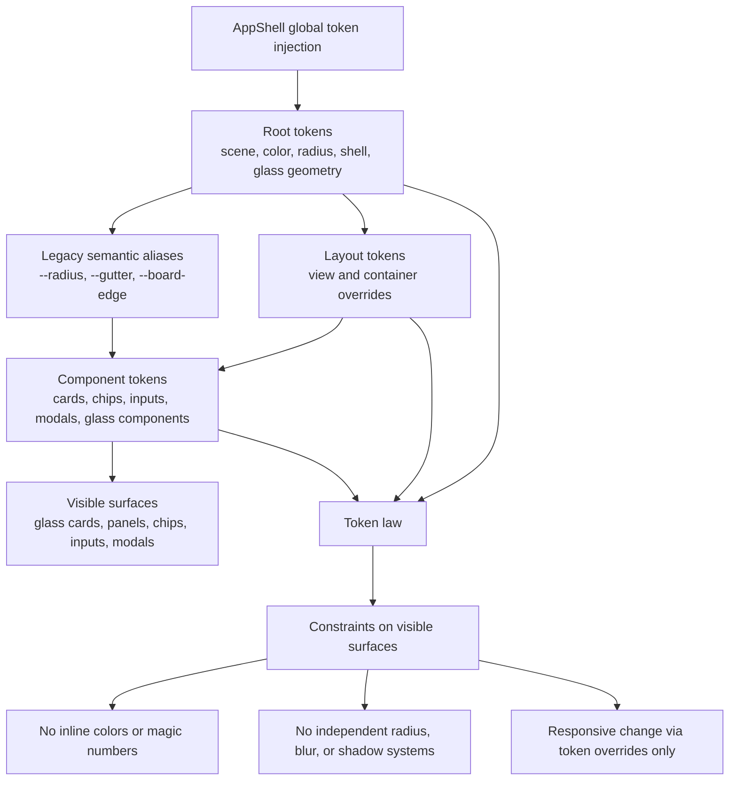
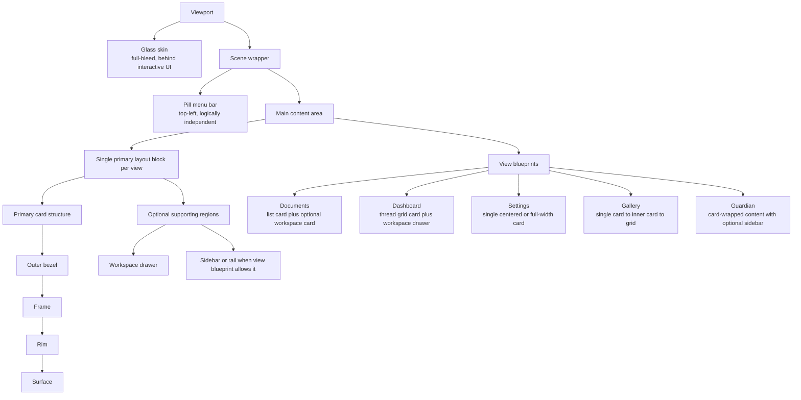
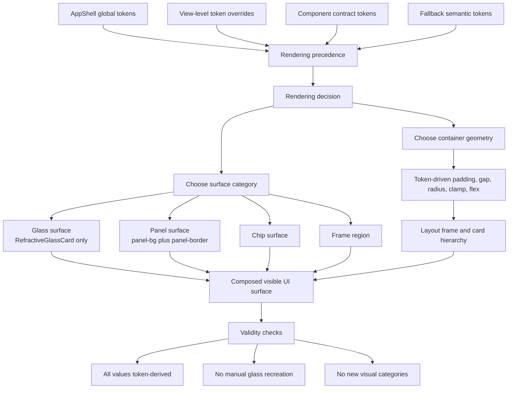
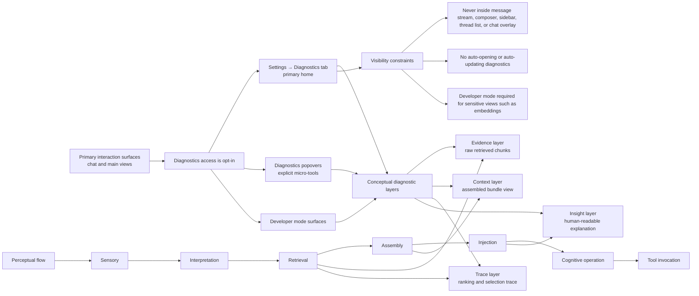

# Codexify UI Diagrams v1

## 1. Title and purpose

This document is the first-pass UI diagram pack derived only from the validated UI canon source set. It maps Codexify's presentation-side architecture for tokens, layout, rendering surfaces, and diagnostics-facing conceptual layers without asserting backend or runtime topology.

## 2. Source set used

- `/docs/dev/ARTIFACT1—UI-Token-Constitution.md`
- `/docs/dev/ARTIFACT1B—CODEXIFY-STRUCTURAL-LAYOUT-SPECIFICATION.md`
- `/docs/dev/ARTIFACT3—Codexify-UI-Rendering-Protocol.md`
- `/docs/dev/ARTIFACT4—COGNITIVE-DIAGNOSTICS-CANON.md`
- `/docs/dev/ARTIFACT7--CODEXIFY-PERCEPTUAL-STACK-SPEC.md`

## 3. Interpretation constraints

- These diagrams describe UI canon and presentation structure, not current backend/runtime topology.
- These diagrams are derived from the validated UI canon only.
- Runtime disagreements must be resolved against the runtime KB, not this document.
- Quarantined legacy docs and implementation guesswork were not used.

## 4. Diagram legend

- `token`: canonical UI variable controlling color, spacing, radius, geometry, or sizing.
- `layout frame`: structural containment layer that positions views and cards.
- `rendering surface`: allowed visual category used to present content, such as glass, panel, chip, or frame.
- `diagnostic surface`: opt-in UI region that exposes cognition or retrieval state.
- `conceptual layer`: a named interpretive layer used to explain UI-facing cognition flow, not runtime deployment.

## 5. Diagram 1: UI Token Hierarchy (high confidence)

This diagram shows the explicit token layers and the constraint path from AppShell-level token injection to visible UI surfaces.

**Evidence notes**

Primary sources:
- `ARTIFACT1` sections II-VIII
- `ARTIFACT3` sections 0-4 and 9

Conservative assumptions:
- "Foundational token layer" is represented as AppShell-injected root tokens because the canon explicitly roots token injection there.
- "Semantic token layer" is represented through layout overrides plus legacy semantic aliases because the canon defines precedence and fallback layers but does not publish a larger design-system taxonomy.

Explicit exclusions:
- No invented sub-taxonomy for typography, motion, or state tokens beyond what the canon names.
- No code-component tree or implementation ownership mapping.

## 6. Diagram 2: Structural Layout Model (high confidence)

This diagram shows the immutable shell-to-view containment model and the major sanctioned layout regions.

**Evidence notes**

Primary sources:
- `ARTIFACT1B` sections II-XII
- `ARTIFACT1` section IV

Conservative assumptions:
- Supporting panels, rails, and drawers are shown only where the layout spec explicitly permits them.
- View blueprints are included as sanctioned structural examples rather than a routing model.

Explicit exclusions:
- No route graph, navigation flow, or frontend file/component map.
- No runtime meaning assigned to workspace drawers, session rails, or sidebars beyond structural placement.

## 7. Diagram 3: Rendering / Surface Composition Model (high confidence)

This diagram shows how layout containers, token precedence, and permitted surfaces combine to produce rendered UI.

**Evidence notes**

Primary sources:
- `ARTIFACT3` sections 0-9
- `ARTIFACT1` sections IV-VIII
- `ARTIFACT1B` section VIII

Conservative assumptions:
- The composition model is synthesized from the rendering precedence stack, decision tree, and canonical card hierarchy to keep the diagram readable.
- Diagnostics overlays are omitted here because the rendering protocol does not define them as a primary rendering branch.

Explicit exclusions:
- No React component tree, prop flow, or renderer internals.
- No runtime event, data, or provider path shown inside the rendering diagram.

## 8. Diagram 4: Diagnostics / Perceptual Stack (moderate confidence)

This diagram shows the UI-facing conceptual relationship between perceptual layers and the diagnostic surfaces that may expose them.

**Evidence notes**

Primary sources:
- `ARTIFACT4` sections 0-5
- `ARTIFACT7` sections 1-4

Conservative assumptions:
- The diagram maps perceptual layers to diagnostic surfaces as a UI-facing conceptual aid; the canon supports both sets but does not provide a single merged visualization.
- Only the diagnostic-relevant perceptual stages are connected to evidence, context, trace, and insight surfaces.

Explicit exclusions:
- No backend observability topology, event bus architecture, or distributed node map.
- No future-only tools from expansion sections are treated as current required surfaces.
- Diagnostics surfaces may render provenance chips and suppression summaries, but they still must not expose raw system prompts, hidden messages, embeddings, or other internal reasoning artifacts.

## 9. Omitted / intentionally excluded areas

- Backend/runtime topology.
- Speculative implementation details not present in the UI canon.
- Future features not defined in the validated UI source set.
- Direct code-component mapping.
- Legacy or quarantined docs.

## 10. Reviewer guidance

This pack is a baseline UI-facing architecture map. Resolve disagreements against the validated UI canon first, not against memory or implementation guesswork.
